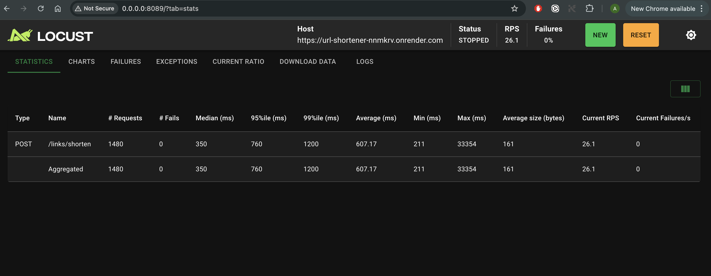

# URL Shortener API

API-сервис для сокращения ссылок с поддержкой аналитики, пользовательских alias, времени жизни ссылок и авторизации пользователей.

## Функциональность

### Основные возможности

* Создание короткой ссылки
* Переход по короткой ссылке (redirect)
* Обновление ссылки
* Удаление ссылки
* Получение статистики переходов
* Поиск по оригинальному URL
* Поддержка пользовательских alias
* Поддержка времени жизни ссылки
* Кэширование популярных ссылок (Redis)

### Авторизация

Пользователь может:

* зарегистрироваться
* авторизоваться
* создавать ссылки
* изменять и удалять **только свои ссылки**

Неавторизованные пользователи могут:

* создавать ссылки
* переходить по коротким ссылкам

---

# API Endpoints

### Auth

POST /auth/register
Регистрация пользователя

POST /auth/login
Авторизация пользователя (получение JWT токена)

---

### Links

POST /links/shorten
Создание короткой ссылки

GET /{short_code}
Редирект на оригинальный URL

PUT /links/{short_code}
Обновление оригинальной ссылки

DELETE /links/{short_code}
Удаление ссылки

GET /links/{short_code}/stats
Получение статистики по ссылке

GET /links/search?original_url={url}
Поиск короткой ссылки по оригинальному URL

---

### Дополнительные функции

GET /links/expired
Получение списка истекших ссылок

GET /links/project/{project_name}
Получение ссылок по проекту

---

# Используемые технологии

* FastAPI
* PostgreSQL
* Redis
* SQLAlchemy
* Docker
* JWT Authentication

---

# Запуск проекта

### 1. Клонировать репозиторий

```bash
git clone https://github.com/AnnaMakarova28/url_shortener_nnmkrv.git
cd url_shortener_nnmkrv
```

### 2. Запустить сервис через Docker

```bash
docker compose up --build
```

### 3. Открыть документацию API

```
http://localhost:8000/docs
```

### 4. Остановить контейнеры

```bash
docker compose down
```

---

# Запуск тестов

### Запуск всех тестов

```bash
pytest tests
```

### Проверка покрытия

```bash
coverage run -m pytest tests
coverage html
coverage report
```

HTML-отчёт покрытия находится в:

```
htmlcov/index.html
```

---

# База данных

Основная таблица:

### links

| поле         | описание                      |
| ------------ | ----------------------------- |
| id           | id ссылки                     |
| original_url | оригинальная ссылка           |
| short_code   | короткий код                  |
| project_name | название проекта              |
| created_at   | дата создания                 |
| expires_at   | дата истечения                |
| clicks       | количество переходов          |
| last_used_at | последний переход             |
| owner_id     | пользователь создавший ссылку |

### users

| поле            | описание           |
| --------------- | ------------------ |
| id              | id пользователя    |
| email           | email пользователя |
| hashed_password | пароль             |

---

# Кэширование

Redis используется для:

* кэширования популярных ссылок
* ускорения редиректов

Кэш очищается при:

* обновлении ссылки
* удалении ссылки

---

# Тестирование

Нагрузочное тестирование проводилось с использованием Locust.
Количество пользователей: 10
Ramp up: 2 users/sec
Endpoint: POST /links/shorten

Результаты:
- Requests: 1480
- Failures: 0
- RPS: ~26
- Median latency: 350 ms
- 95 percentile: 760 ms


### Test Coverage

Coverage report:  
`htmlcov/index.html`

coverage = 90%